# ARCHITECTURE DIAGRAMS

This document provides diagram-level views of the AI Video Rewriter & Video Rebuilder system.

Diagrams use Mermaid syntax.

---

## 1. Component Diagram

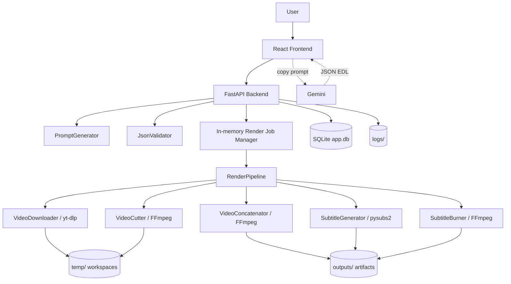

---

## 2. Prompt Generation Sequence

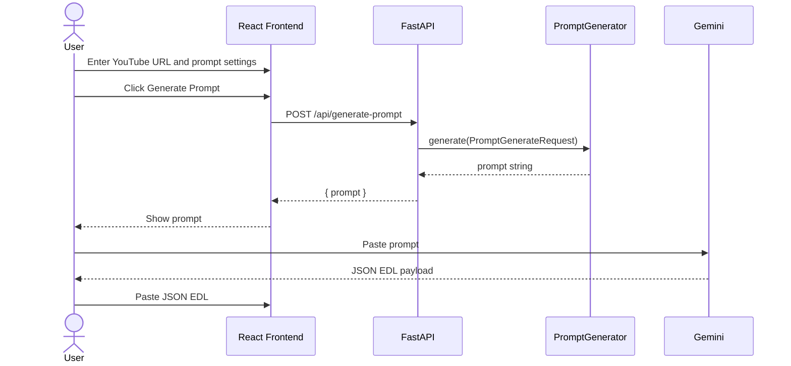

---

## 3. JSON Validation Sequence

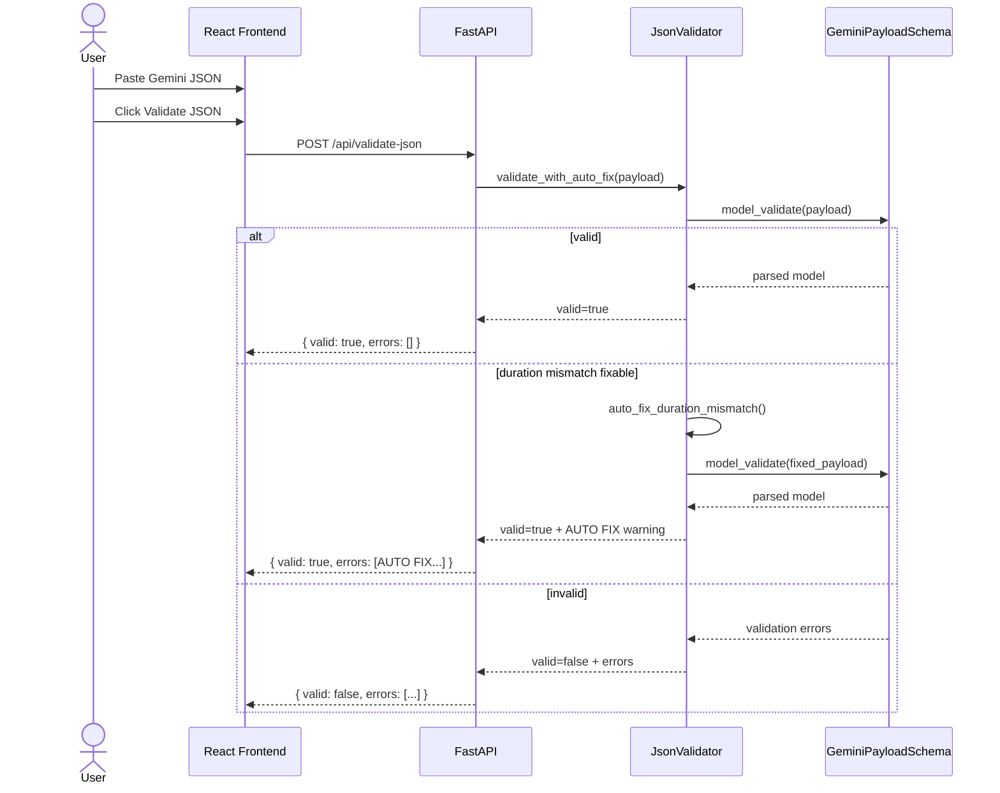

---

## 4. Async Render Job Sequence

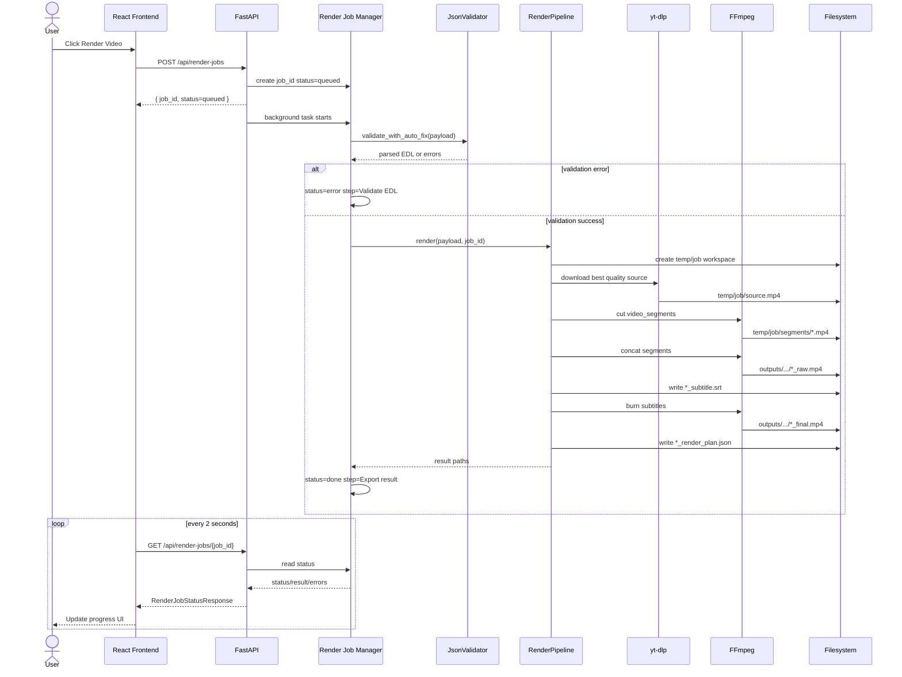

---

## 5. Data Flow Diagram

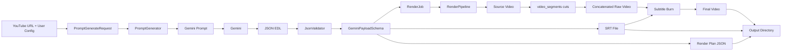

---

## 6. EDL Data Relationship

```mermaid
erDiagram
    GEMINI_PAYLOAD ||--|| METADATA : contains
    GEMINI_PAYLOAD ||--|| REWRITE_SCRIPT : contains
    GEMINI_PAYLOAD ||--o{ SRT_ITEM : contains
    GEMINI_PAYLOAD ||--o{ VIDEO_SEGMENT : contains

    SRT_ITEM {
        int index
        string start
        string end
        string text
    }

    VIDEO_SEGMENT {
        int segment_id
        int order
        string source_start
        string source_end
        int subtitle_start
        int subtitle_end
        string scene_description
        int importance_score
    }

    VIDEO_SEGMENT }o--o{ SRT_ITEM : references_by_subtitle_range
```

---

## 7. Preset Data Model

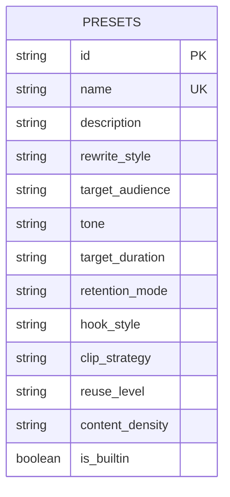

---

## 8. Deployment View

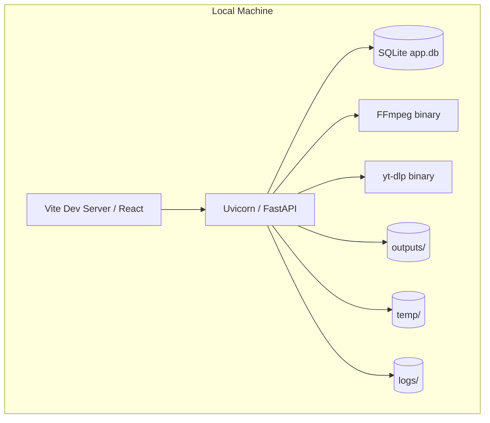

---

## 9. Title Layout Sequence (Phase A)

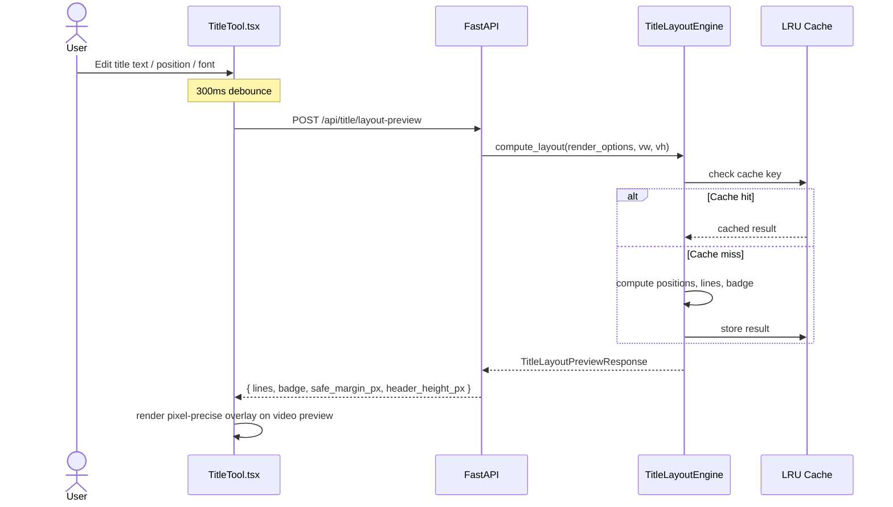

---

## 10. Blur Keyframe Sequence (Phase B)

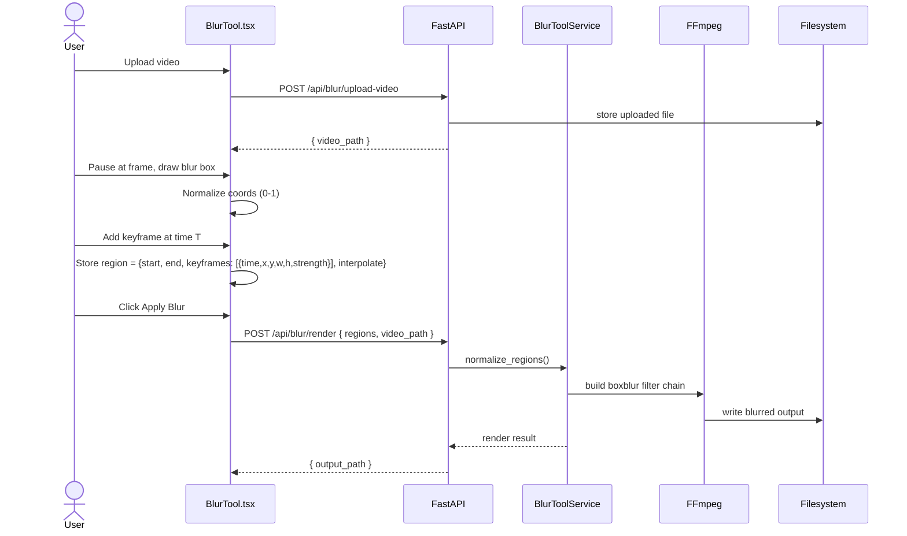

---

## 11. Subtitle Style Flow (Phase C)

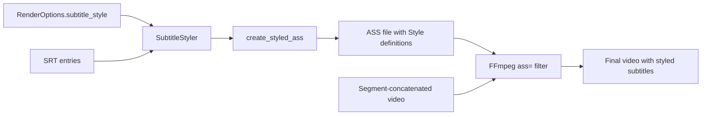

---

## 12. Prompt Builder Flow (PromptComposer)

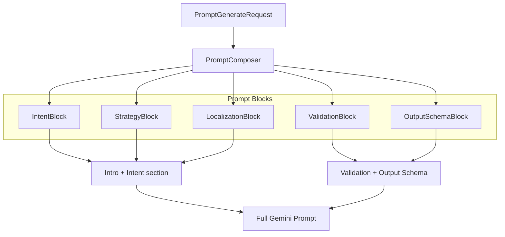

---

## 13. Prompt Telemetry Flow (Phase D)

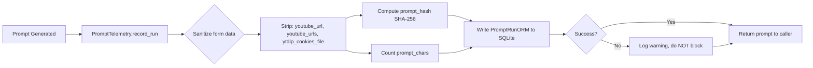

---

## 14. Preset Recommendation Flow (Phase E)

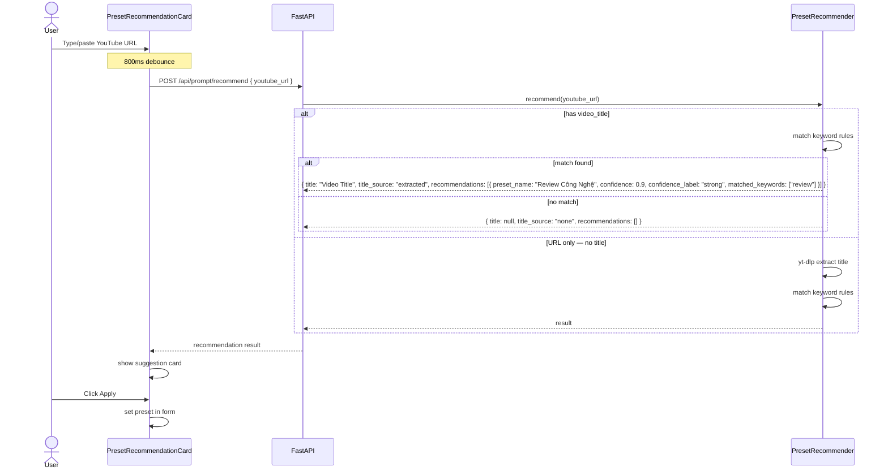

---

## 15. Full Database Schema

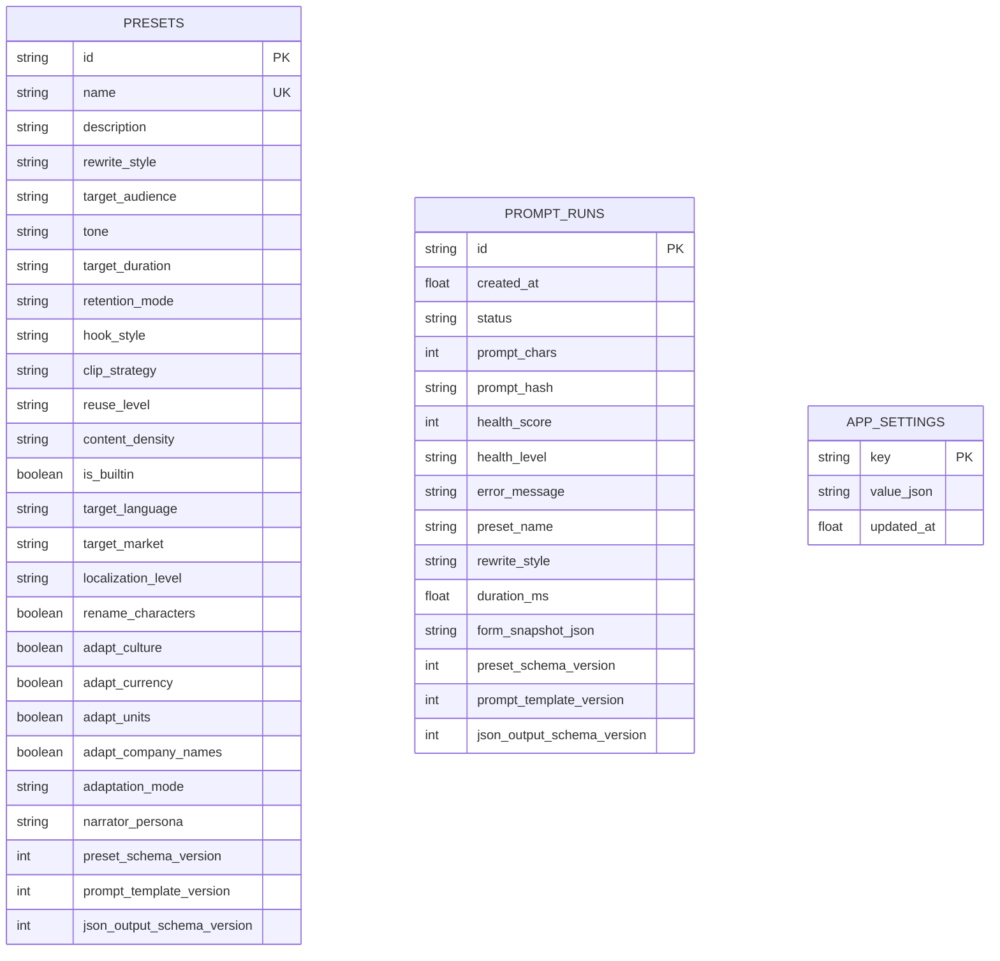

---

## 16. Packaged Deployment View

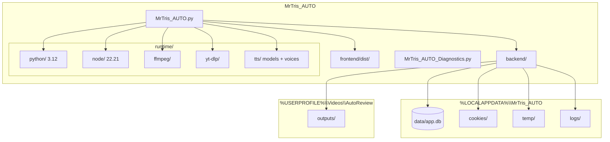
